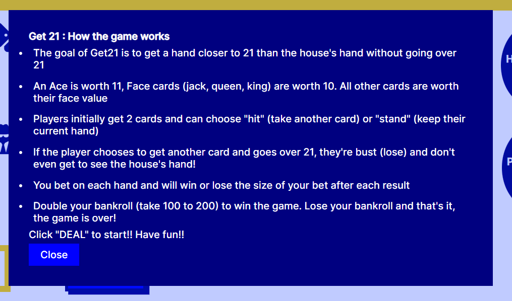

---

Get 21 is a fun card game for users that want to practice basic blackjack skills. Double your bankroll to win the game! ... but loss all your chips and the game is over!

## User Stories

 - As a user I want to be able to play a card game with simple rules, so that I can have fun and practice my decision making skills

 - As a user I want the game to begin at the start when arriving at the site, so that I can start a fresh go when I first arrive back at the page

 - As a user I want to be able to see the cards I'm dealt and get shown the total I am on, so that I am able to make a good decision on what to do next

 - As a user I want to be able to see whether I have won or lost the hand (and why) so that I can make goods decisions in future rounds of the game

 - As a user I want to be able to bet different amounts on different hands to try my luck and "go big" if I wish, so that the game is engaging and fun to play

 - As a user I want to see the score as I am playing so that I can understand how well I am doing in the game

 - As a user I want to understand that a 200+ bankroll is a winning score so that I can aim to reach this goal and receive some congratulations if I achieve it

 - As a user I want to understand that a 0 bankroll is a losing score so that I can aim to avoid reaching this score and receive some commiserations if I ultimately achieve it

 - As a user I want to hear celebration or commiseration sounds depending on if I win or lose the game, so that I can enjoy the experience and further understand what the outcome has been achieved

## Features

### Main Game Area

The single page includes a header, with a clickable info button showing the rules:

When clicked, the rules are shown as follows:

A main game area shows 3 cards for the player and 3 cards for the house in the main game area:

There is a section showing the players bet, their bankroll, the game action buttons and a message box:

The page includes a footer, with a link to my github:

## Technical Diagram

The game logic and technical workflow was designed in advance (using Miro), ensuring a sound game play flow:

---
## Technologies Used

- [HTML](https://developer.mozilla.org/en-US/docs/Web/HTML) was used as the foundation of the site.
- [CSS](https://developer.mozilla.org/en-US/docs/Web/css) - was used to add the styles and layout of the site.
- [CSS Flexbox](https://developer.mozilla.org/en-US/docs/Learn/CSS/CSS_layout/Flexbox) - was used to arrange items symmetrically on the pages.
- [JavaScript](https://developer.mozilla.org/en-US/docs/Web/JavaScript) was used to build game play logic and features.
- [Miro](https://miro.com/templates/diagrams/) was used to sketch the technical diagram.
- [Balsamiq](https://balsamiq.com/) was used to make wireframes for the website.
- [VSCode](https://code.visualstudio.com/) was used as the main tool to write and edit code.
- [Git](https://git-scm.com/) was used for the version control of the website.
- [GitHub](https://github.com/) was used to host the code of the website.

---
## Design

## Wireframes

The basic structure of the website was created using Balsamiq:
[here](documentation/get21-wireframes.pdf)

## Testing

In order to confirm the correct functionality, responsiveness, and appearance:

+ The website was tested on the following browsers: Chrome, Firefox, Brave.

+ The website was checked with 

    - Desktop Screens: [here](documentation/desktop-get21.png)

    - Tablet Screens: [here](documentation/tablet-get21.png)

    - Mobile Screens: [here](documentation/mobile-get21.png)

+ The functionality of the game in the website was checked as well by different users.

### Manual testing

| feature | action | expected result | tested | passed | comments |
| --- | --- | --- | --- | --- | --- |
| Game Play | | | | | |
| Initial Game State | Refresh page and review set up | All cards are shown face down, a bankroll of 100 & scores at 0 | Yes | Yes | - |
| Stake not set | No entry is made in the stake box, but "Deal" button pressed  | A message appears showing the user that they can't bet nothing and a new deal is offered | Yes | Yes | - |
| Stake greater than Bankroll | Player chooses a stake higher than the Bankroll available  | A message appears showing the user that they can't bet this amount and a new deal is offered | Yes | Yes | - |
| Initial Deal | Enter a valid stake and click on the "Deal" button | The player receives 2 cards, the correct total is shown on the player score and the Hit/Stand choice is offered | Yes | Yes | - |
| Player chooses "Hit" |The "Hit" button is clicked |The player receives a third card, the correct total is calcuated and the house is dealt its cards |Yes |Yes | |
| Player chooses "Stand" and Busts |The "Stand" button is clicked |The player does not receive a third card, the result of the game is calculated as a loss, with the house cards not shown |Yes |Yes | |
| Player chooses "Stand" and scores 21 or lower |The "Stand" button is clicked |The player does not receive a third card, the house hand is dealt correctly, the game result is calculated correctly |Yes |Yes | |
| Hand result is calculated correctly |The hand is concluded after "Hit" or "Stand" |The player score is shown correctly, the house score is show correctly, a win or lose message is displayed correctly |Yes |Yes | |
| Hand outcome of a win is shown correctly |A hand is concluded |The Bankroll is updated to reflect the win, in line with the bet amount |Yes |Yes | |
| Hand outcome of a loss is shown correctly |A hand is concluded |The Bankroll is updated to reflect the loss, in line with the bet amount |Yes |Yes | |
| Game outcome of a win is shown correctly |The player reaches a bankroll of 200 or greater after as many hands as necessary |A congratulations message is shown, a celebration sound is played, the user is offered a restart option |Yes |Yes | |
| Game outcome of a loss is shown correctly |The player reaches a bankroll of 0 after as many hands as necessary |A commiseration message is shown, a commiseration sound is played, the user is offered a restart option |Yes |Yes | |
| Modal | | | | | |
| Game rules are shown  |The "i" button is clicked | The rules of the game are shown to the player |Yes |Yes | |
| Game rules are hidden |The screen is clicked when the modal is open | The rules of the game are no longer shown to the player and the game is playable |Yes |Yes | |
| Sound | | | | | |
| Sound plays  |The sound toggle is clicked on | Sounds play when hands are won or lost |Yes |Yes | |
| Sound does not play |The sound toggle is left off  | Sounds do not play when hands are won or lost |Yes |Yes | |
| Footer | | | | | |
| Github icon in the footer | Click on the Github icon | The user is redirected to the Github page | Yes | Yes | - |

---
### Bugs
+ ##### Solved bugs
    1.  A hand was played despite the user selecting an undefined or 0 level bet. This was due to an error in the checkBetSize function, in which these scenarios were not validated:

    
    
    Solutions: further tests were added to the function to capture these additional scenarios:
    
    
    ---

    2.  The game wouldn't return to a new state, following the completion of the stated game goal. It would simply continue and fire a new hand. This was due to missing commands in the newHand function:

    
    
    Solutions: a restart function was created that fired the newHand function, whilst also triggering other necessary reset commands:

    
    ---
+ ##### Unsolved bugs
    - None.

+ ##### Mistakes
    - The game was initially created without the bet feature. This made the user experience lack engagement.

---
## Validator testing
+ ### HTML
  #### Main Page
  - No errors or warnings were found when passing through the official W3C validator.

    
+ ### CSS
  - No errors were found when passing through the official W3C (Jigsaw) validator:

+ ### Lighthouse Report: Accessibility and performance 
  - Using lighthouse in devtools I confirmed that the website is performing well, accessible and colors and fonts chosen are readable.

---
## Deployment

- The site was deployed to GitHub pages. The steps to deploy are as follows: 
  - In the [GitHub repository](https://github.com/t0bes1/get21), navigate to the Settings tab 
  - From the source section drop-down menu, select the **Main** Branch, then click "Save".
  - The page will be automatically refreshed with a detailed ribbon display to indicate the successful deployment.

## Local Deployment

In order to make a local copy of this project, you can clone it.
In your IDE Terminal, type the following command to clone my repository:

- `git clone https://github.com/t0bes1/get21.git`

---
## Credits

+ #### Content

  - All content has been created personally, aside from the card images
  - [Public Domain Card Images](https://opengameart.org/content/playing-cards-vector-png) were acquired from Open Game Art; thanks to them for making the design process much easier!
  - [Uppbeat](https://uppbeat.io/sfx) provided the win & lose game sound effects
  - [Pixabay](https://pixabay.com/sound-effects/) provided the win & lose hand sound effects
---

## Acknowledgments

- [Code Institute](https://codeinstitute.net/) tutors and Slack community members for their support and help.

---